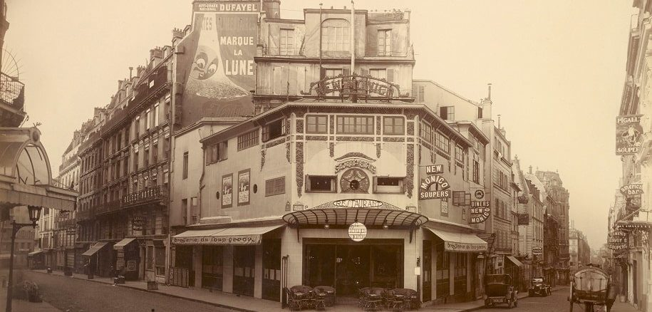
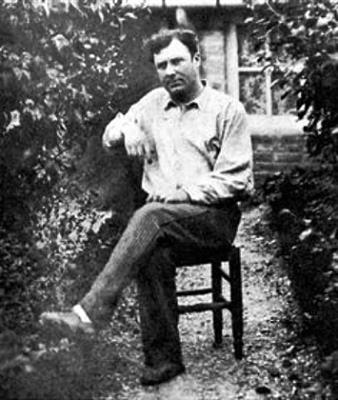

# 🙤 **PARTIE Ⅰ** 🙧 
# Peuplement d'un graphe de connaissance sur l'œuvre photographique d'[Eugène Atget](https://fr.wikipedia.org/wiki/Eug%C3%A8ne_Atget) à partir des portails de données de la bibliothèque nationale de France

     
    

🙑 Eugène Atget (1857‑1927) est un photographe français, pionnier de la photographie documentaire, actif au tournant du XXe siècle. Il a construit une œuvre photographique monumentale qui documente avec rigueur le Paris de la Belle Époque, de la Zone et ses environs, avant et pendant les profondes transformations urbaines du début du XXᵉ siècle. Ses images décrivent les rues, les façades, les boutiques, les cours, les jardins et les scènes de la vie quotidienne avec une précision visuelle remarquable, cherchant moins à créer une esthétique artificielle qu’à enregistrer minutieusement la réalité urbaine. Atget n’aspirait pas à être vu comme un artiste au sens traditionnel : il envisageait la photographie d’abord comme un outil documentaire permettant de fixer des éléments de la ville menacés de disparition. Cependant, au fil du temps Atget évolue de la simple documentation architecturale (1890-1905) et adopte un regard plus attentif aux traces de vie humaine et sociale, photographiant artisans, travailleurs des rues et habitants de la zone. L’accumulation de ces vues confère à son œuvre une puissance métaphysique et poétique qui a séduit bien au‑delà de son intention initiale, influençant notamment les surréalistes et des générations de photographes modernes. Dans sa diversité, l’œuvre d’Atget se situe à l’intersection du document social et historique et d’une forme naissante de lecture critique de l’espace urbain, interrogeant la visibilité des corps et des constructions dans le paysage citadin.
Aujourd’hui, la BnF conserve plus de 4 500 épreuves positives d’Atget, réparties en séries thématiques élaborées par lui‑même ou par la bibliothèque, ainsi que plusieurs albums qu’il a constitués. Cette immense archive, complétée par d’autres fonds publics et privés, fait d’Atget une figure centrale de la photographie documentaire et un témoignage unique du vieux Paris, oscillant entre la constatation archivistique et l’évocation sensible du temps qui passe. 🙗

<small>Source : Rizov, V. (2021). Eugène Atget and documentary photography of the city. Theory, Culture & Society, 38(3), 141-163. Pour en apprendre plus sur Eugène Atget et son oeuvre : https://expositions.bnf.fr/atget/arret/01.htm et https://gallica.bnf.fr/accueil/fr/html/sur-les-traces-du-paris-datget

Photos : à gauche le "New Monico", 1925. À droite : portrait photographique d'Eugène Atget vers 1890, auteur inconnu.
</small>

## 🙤 Objectifs

Cette première partie guide la construction d'une base de données locale indexant les photographies d'Eugène Atget archivées, inventoriées et numérisées par la BnF. Les métadonnées utiles sont exposées sur différents points d'accès de la BnF : [Gallica]() pour les numérisations, [le catalogue général de la bibliothèque]() pour les notices bibliographiques, [data.bnf.fr]() pour les métadonnées publiques en RDF.

Nous allons construire cette base de données sous la forme d'un **graphe de connaissances RDF** en collectant les informations sur les photographies de Atget à partir des **APIs** de la BnF. Ces donnes nous serviront plus tard pour **géolocaliser** réaliser un **explorateur cartographique interactif** du fond Atget de la BnF.

Le modèle du graphe de connaissances est pertinent  pour trois raisons : 
1.  les données sont **déjà partiellement disponibles en triplets RDF** ;
2.  les **métadonnées très imbriquées** de la BnF s'adaptent très bien à une représentation en graphe, mais très mal à de "simples" tableaux  ;
3.  un graphe de connaissance est **facile à enrichir** de nouvelles informations

Nous allons voir :
- les différents points d'accès aux métadonnées de la BnF et les modes de récupération liés : API SRU de Gallica, SPARQL endpoint de data.bnf.fr
- comment exécuter des requêtes SPARQL distantes en Python avec *SPARQLWrapper* pour récupérer des données ;
- comment manipuler un graphe RDF en Python avec *rdflib* ;
- comment visualiser un graphe de connaissances RDF en Python avec *PyVis*.
